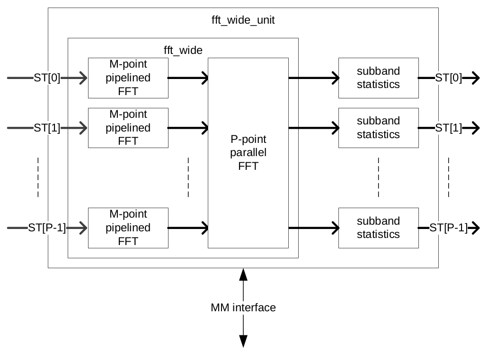
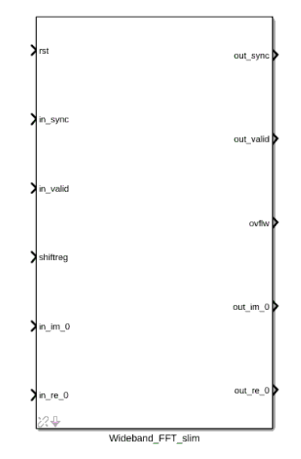
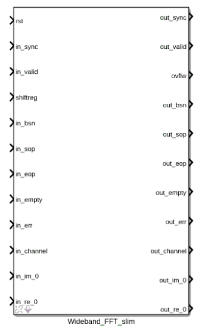
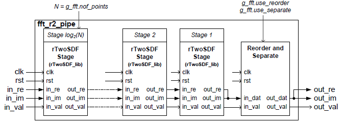
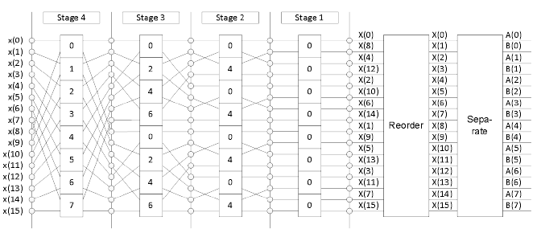
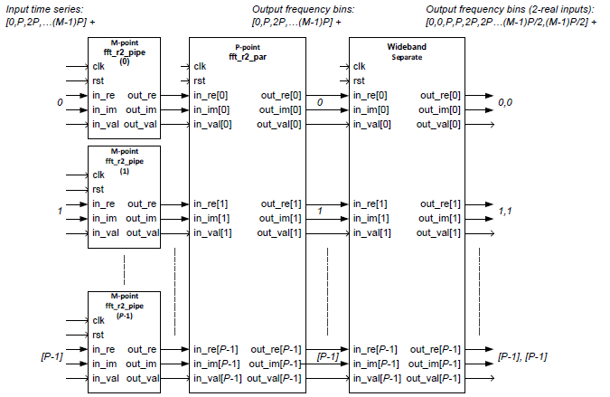
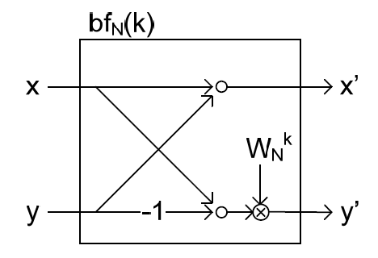
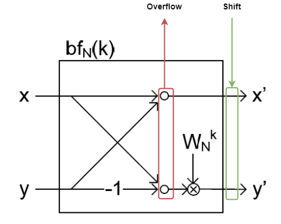

############
Wideband FFT
############
.. _wb_fft:

*******
Purpose
*******
.. _wb_purpose:

This FFT was originally sourced from ASTRON via OpenCores. It performs an N-Point Wideband FFT on data that is partly applied in serial and partly applied in
parallel. This FFT specifically suits applications where the sample clock is higher than the DSP processing clock. For each output stream a subband statistic
unit is included which can be read via the memory mapped interface.

This unit connects an incoming array of streaming interfaces to the wideband fft. The output of the wideband fft is 
connected to a set of subband statistics units. The statistics can be read via the memory mapped interface (TODO). 
A control unit takes care of the correct composition of the output streams(sop,eop,sync,bsn,err). These signals are 
optional and can be removed to only use the sync signal.

This unit only handles one sync at a time. Therefore the sync interval should be larger than the total
pipeline stages of the wideband FFT.

***************
Module Overview
***************
.. _wb_module:

An overview of the fft_wide unit is shown in Figure 1. The fft_wide unit calculates a N-point FFT and has P
number of input streams. Data of each input is offered to a M-point pipelined FFT, where M=N/P. The output
of all pipelined FFTs is then connected to a P-point parallel FFT that performs the final stage of the wideband
FFT. Each output of the parallel FFT is connected to a subband statistics unit that calculates the power in
each subband. The MM interface is used to read out the subband statistics.
The rTwoSDF pipelined FFT (see :ref:`r2sdf_fft`) design is used as building block for the development of the wideband extension.

******************
Firmware Interface
******************
.. _wb_firm_interface:

=============
Clock Domains
=============
There are two clock domains used in the fft_wide unit: the mm_clk and the dp_clk domain. Figure 2 shows
an overview of the clock domains in the fft_wide unit. The only unit that is connected to both clock domains is
the memory of the subband statistics module. This memory is a dual ported ram that holds the results of the
subband statistics. Table 1 lists both clocks and their characteristics.

+--------+----------------+------------------------+
| Name   | Frequency (MHz)| Description            |
+========+================+========================+
| DP_CLK | 200 MHz        | Clock for datapath     |
+--------+----------------+------------------------+
| MM_CLK | 125 MHz        | Clock for mm interface |
+--------+----------------+------------------------+

=================
Interface signals
=================

Figure 2 shows the Simulink Wideband FFT block in its base configuration. In this form, it offers a minimal set of input/output ports that are comparable with
what the CASPER FFT offers. 

Figure 3 shows the Simulink Wideband FFT block in its expanded configuration which offers the bsn, sop, eop, error, empty and channel control signals. Their function is
explained by the graph below.

The full set of signals available to the Simulink block are detailed in the table below.

+----------------+-----------------+---------------------------+----------------------------------------------------------------+
| Signal         | Type            | Size                      | Description                                                    |
+================+=================+===========================+================================================================+
| Reset          | std_logic       | 1                         | Datapath reset.                                                |
+----------------+-----------------+---------------------------+----------------------------------------------------------------+
| Clock enable   | std_logic       | 1                         | Clock enable signal (used by Xilinx black box).                |
+----------------+-----------------+---------------------------+----------------------------------------------------------------+
| Clock          | std_logic       | 1                         | Datapath clock (used by Xilinx black box).                     |
+----------------+-----------------+---------------------------+----------------------------------------------------------------+
| Sync           | std_logic       | 1                         | In/out sync pulse, preceeds data by 1 clock cycle.             |
+----------------+-----------------+---------------------------+----------------------------------------------------------------+
| Valid          | std_logic       | 1                         | In/out valid data signal. Goes high with first valid data      | 
|                |                 |                           | sample.                                                        |
+----------------+-----------------+---------------------------+----------------------------------------------------------------+
| Shiftreg       | std_logic_vector| :math:`\log2(nof\_points)`| Bit vector dictating at which stages to shift in an N-point    | 
|                |                 |                           | FFT. A '1' indicates a shift while a '0' indicates no shift at |
|                |                 |                           | that stage.                                                    |
+----------------+-----------------+---------------------------+----------------------------------------------------------------+
| Ovflw          | std_logic_vector| :math:`\log2(nof\_points)`| Bit vector dictating at which stages overflow occured in an    | 
|                |                 |                           | N-point FFT. A '1' indicates an overflow while a '0' indicates |
|                |                 |                           | no overflow at that stage.                                     |
+----------------+-----------------+---------------------------+----------------------------------------------------------------+
| bsn            | std_logic_vector| 64                        | A timestamp identification port for the data.                  |
+----------------+-----------------+---------------------------+----------------------------------------------------------------+
| sop            | std_logic       | 1                         | A start-of-packet indicator (see figure 4 for detail).         |
+----------------+-----------------+---------------------------+----------------------------------------------------------------+
| eop            | std_logic       | 1                         | An end-of-packet indicator (see figure 4 for detail).          |
+----------------+-----------------+---------------------------+----------------------------------------------------------------+
| Empty          | std_logic_vector| 16                        | Empty signal for the sosi data packet.                         |
+----------------+-----------------+---------------------------+----------------------------------------------------------------+
| Error          | std_logic_vector| 32                        | Error indicator giving 32 different one-hot encoded errors.    |
+----------------+-----------------+---------------------------+----------------------------------------------------------------+
| Channels       | std_logic_vector| 32                        | An indicator for mapping of channels to streams.               |
+----------------+-----------------+---------------------------+----------------------------------------------------------------+
| Im             | std_logic_vector| in_dat_w or out_dat_w     | Data port for either one polarisation (when doing a dual pol   |  
|                |                 |                           | FFT), or the imaginary part (when doing a complex FFT).        |
+----------------+-----------------+---------------------------+----------------------------------------------------------------+
| Re             | std_logic_vector| in_dat_w or out_dat_w     | Data port for either one polarisation (when doing a dual pol   |  
|                |                 |                           | FFT), or the real part (when doing a complex FFT).             |
+----------------+-----------------+---------------------------+----------------------------------------------------------------+

-----------
Complex FFT
-----------
For complex input use_separate = false.
When use_reorder=true then the output bins of the FFT are re-ordered to 
undo the bit-reversed (or bit-flipped) default radix 2 FFT output order.
The fft_r2_wide then outputs first 0 Hz and the positive frequencies
and then the negative frequencies. The use_reorder is performed at both
the pipelined stage and the parallel stage.

When use_fft_shift=true then the fft_r2_wide then outputs the frequency
bins in incrementing order, so first the negative frequencies, then 0 Hz
and then the positive frequencies.
When use_fft_shift = true then also use_reorder must be true.

--------------
Two Real FFT's
--------------
When use_separate=true then the fft_r2_wide can be used to process two
real streams. The first real stream (A) presented on the real input, the
second real stream (B) presented on the imaginary input. The separation
unit outputs the spectrum of A and B in an alternating way.
When use_separate = true then also use_reorder must be true.
When use_separate = true then the use_fft_shift must be false, because
fft_shift() only applies to spectra for complex input.

-------
Remarks
-------
This FFT supports a wb_factor = 1 (= only a fft_r2_pipe
instance) or wb_factor = g_fft.nof_points (= only a fft_r2_par instance).
Care must be taken to properly account for guard_w and out_gain_w,
therefore it is best to simply use a structural approach that generates
seperate instances for each case:

* wb_factor = 1                                  --> pipelined FFT
* wb_factor > 1 AND wb_factor < g_fft.nof_points --> wideband FFT
* wb_factor = g_fft.nof_points                   --> parallel FFT

This FFT uses the use_reorder in the pipeline FFT, in the parallel
FFT and also has reorder memory in the fft_sepa_wide instance. The reorder
memories in the FFTs can maybe be saved by using only the reorder memory
in the fft_sepa_wide instance. This would require changing the indexing in
fft_sepa_wide instance (TODO).

The reorder memory in the pipeline FFT, parallel FFT and in the
fft_sepa_wide could make reuse of a reorder component from the reorder
library instead of using a dedicated local solution (TODO).

==========
Parameters
==========
.. _wb_fft_params:

Both the wideband and pipelined FFT's offer a set of parameters for control over the
FFT's characteristics, data handling and implementation on the FPGA. These are tabulated below.

--------------
FFT parameters
--------------

+----------------+---------+--------+----------------------------------------------------------------+
| Generic        | Type    | Value  | Description                                                    |
+================+=========+========+================================================================+
| Bit-reverse    | Boolean | true   | When set to ‘true’, the output bins of the FFT are reordered   |
| output         |         |        | in such a way that the first bin represents the lowest         |
|                |         |        | frequency and the highest bin represents the highest frequency.|
+----------------+---------+--------+----------------------------------------------------------------+
| Reorder        | Boolean | false  | False for [0, pos, neg] bin frequencies order, true for        |
| frequencies    |         |        | [neg, 0, pos] bin frequencies order in case of complex input   |  
+----------------+---------+--------+----------------------------------------------------------------+
| Separate       | Boolean | true   | When set to ‘true’ a separate algorithm will be enabled in     |
| complex in/out |         |        | order to retrieve two separate spectra from the output of the  |
| ports?         |         |        | complex FFT in case both the real and imaginary input of the   |
|                |         |        | complex FFT are fed with two independent real signals.         |
+----------------+---------+--------+----------------------------------------------------------------+
| Nof channels   | Natural | 0      | Defines the number of channels (=time-multiplexed input        |
|                |         |        | signals). The number of channels is :math:`2^{nof\_channels}`. |
|                |         |        | Multiple channels is only supported by the pipelined FFT.      |
+----------------+---------+--------+----------------------------------------------------------------+
| Wideband       | Natural | 4      | The number that defines the wideband factor. It defines the    |
| factor         |         |        | number of parallel pipelined FFTs.                             |
+----------------+---------+--------+----------------------------------------------------------------+
| Twiddle        | Natural | 0      | The twiddle offset is used for the pipelined sections in the   |
| offsets        |         |        | wideband configuration.                                        |
+----------------+---------+--------+----------------------------------------------------------------+
| Number of      | Natural | 1024   | The number of points of the FFT.                               |
| points         |         |        |                                                                |
+----------------+---------+--------+----------------------------------------------------------------+
| Extra control  | Boolean | false  | Checking this box enables the usage of addition signals. See   |
| signals        |         |        | :ref:`_wb_arch` for detail on these ports.                     |
+----------------+---------+--------+----------------------------------------------------------------+

---------------
Data parameters
---------------

+----------------+---------+--------+----------------------------------------------------------------+
| Generic        | Type    | Value  | Description                                                    |
+================+=========+========+================================================================+
| Input data     | Natural | 8      | Width in bits of the input data. This value specifies the      |
| width          |         |        | width of both the real and the imaginary part.                 |
+----------------+---------+--------+----------------------------------------------------------------+
| out_dat_w      | Natural | 14     | The bitwidth of the real and imaginary part of the output of   |
|                |         |        | the FFT. The relation with the in_dat_w is as follows:         |
|                |         |        | :math:`out\_dat\_w=in\_dat\_w+(\log2(nof\_N))/{2+1}`.          |
+----------------+---------+--------+----------------------------------------------------------------+
| stage_dat_w    | Natural | 18     | The bitwidth of the data that is used between the stages       |
|                |         |        | (=DSP multiplier-width).                                       |
+----------------+---------+--------+----------------------------------------------------------------+
| guard_w        | Natural | 2      | Number of bits that function as guard bits. The guard bits are |
|                |         |        | required to avoid overflow in the first two stages of the FFT. |
+----------------+---------+--------+----------------------------------------------------------------+
| guard_enable   | Boolean | true   | When set to ‘true’ the input is guarded during the input resize|
|                |         |        | function, when set to ‘false’ the input is not guarded, but the|
|                |         |        | scaling is not skipped on the last stages of the FFT (based on |
|                |         |        | the value of guard_w).                                         |
+----------------+---------+--------+----------------------------------------------------------------+
| Rounding       | String  | "ROUND"| Gives control over the removal of the least significant bits   |
| behaviour      |         |        | when requantising. See :ref:`_wb_quant` for further detail.    |
|                |         |        | Options are "ROUND" or "TRUNCATE".                             |
+----------------+---------+--------+----------------------------------------------------------------+ 
| Overflow       | String  | "WRAP" | Gives control over the removal of the most significant bits    |
| behaviour      |         |        | when requantising. See :ref:`_wb_quant` for further detail.    |
|                |         |        | Options are "WRAP" and "SATURATE".                             |
+----------------+---------+--------+----------------------------------------------------------------+

--------------------
Synth/Imp Parameters
--------------------

+----------------+---------+--------+----------------------------------------------------------------+
| Generic        | Type    | Value  | Description                                                    |
+================+=========+========+================================================================+
| Use DSP for    | String  | "YES"  | Sets the Xilinx use_dsp directive to force usage or non-usage  |
| Cmults         |         |        | of DSP48 elements when synthesizing/implementing the complex   |
|                |         |        | multipliers.                                                   | 
+----------------+---------+--------+----------------------------------------------------------------+
| Cmult options  | String  | "4DSP" | Sets which complex multipliers are used in the FFT. Options are|
|                |         |        | "3DSP" for a  Gaussian complex multiplication instantiation    |
|                |         |        | that uses 3 DSP48 elements or "4DSP" for a classic complex     |
|                |         |        | multiplication that uses 4 DSP48 elements.                     | 
+----------------+---------+--------+----------------------------------------------------------------+
| Vendor         | Natural | 0      | 0 for Xilinx FPGA's, 1 for Intel FPGA's.                       |
+----------------+---------+--------+----------------------------------------------------------------+
| RAM primitive  | STRING  | "auto" | Parameter for the xpm BRAM module which will dictate how BRAM's|
|                |         |        | are implemented on the FPGA. Options are "auto", "distributed",|
|                |         |        | "ultra" and "block".                                           |
+----------------+---------+--------+----------------------------------------------------------------+
| FIFO primitive | STRING  | "auto" | Parameter for the xpm FIFO module which will dictate how FIFO's|
|                |         |        | are implemented on the FPGA. Options are "auto", "distributed",|
|                |         |        | "ultra" and "block".                                           |
+----------------+---------+--------+----------------------------------------------------------------+

*******************
Module Architecture
*******************
.. _wb_arch:

Several subdesigns were defined in order to create the eventual wideband decimation in frequency (DIF) FFT. These sub-designs are:

- Complex Pipelined FFT for two real inputs (fft_r2_pipe).
- Complex Parallel FFT for two real inputs (fft_r2_par).
- Complex Wideband FFT for two real inputs (fft_r2_wide).

===========
fft_r2_pipe
===========
The architecture for a pipelined FFT is based on design units from the rTwoSDF_lib and is basically the same as the rTwoSDF unit. The difference with respect to the rTwoSDF unit is that
the fft_r2_pipe unit must be capable of processing two real inputs as well. Therefore the archtectural block diagram is extended with an optional separate function. Figure 4 gives an
archtectural overview of the design.

==========
fft_r2_par
==========

In the case of a parallel FFT, all time domain samples for a slice come in parallel and therefore all multiplications and additions have to be performed in parallel as well. The architecture
for a parallel for a parallel FFT is shown in Figure 5. In Figure 5, the number of points is set to 16. Each square represents an optimised complex butterfly. The numbers in the butterfly
refer to the exponent k in :math:`W_N^k` (the twiddle factors). The parallel FFT is also capable of reordering the output data and processing two real inputs. Therefore a parallel reorder
and parallel separate function are defined as well.

===========
fft_r2_wide
===========
The wideband variant of the FFT is partly pipelined and partly composed in parallel. The amount of parallelization is specified by P (wideband factor). The architecture is shown in Figure
6. The reorder functionality is inherited from both the fft_r2_par and fft_r2_pipe units, but for the separation functionality a dedicated wideband variant must be designed.

  

============
Quantisation
============
.. _wb_quant:

Requantisation is required for every butterfly in the FFT. With the FFT being a DIF FFT, the butterfly operation is shown in Figure 7 and it's algorithmic operation is detailed below:

.. math:: 
   x' = x + y

.. math:: 
   y' = W_N^k \times (x - y)

Each butterfly performs an addition and multiplication. For fixed point number systems of values in the range :math:`(0.5, -0.5]` we get MSB growth from additions and LSB growth from
multiplications. The LSB growth from multiplication may be sliced away (which introduces minor effects due to the rounding scheme). This wideband FFT offers the option to truncate 
or round away from zero (TODO: introduce even rounding).
MSB growth from addition will cause overflow that may be handled in two ways: SATURATE the value or WRAP it. Wrapping will use no logic while saturation will require logic to prevent
natural wrapping. Ideally however, the effect of overflow in the FFT is irreversible and as such should be prevented. This is done by scaling the data by 2 before entry into each stage,
and by extension each butterfly operating in parallel for that stage. Fine-control over which stages the FFT should apply a shift for is possible by populating the shiftregister port.
Should overflow occur in any of the butterflies in the FFT, the overflow register will populate that bit-index with a '1'. Figure 8 shows the location of the overflow reporting and shift
within the butterfly.

The shift operation acts on value :math:`A` as:

.. math::
   A' = round(A >> 1, "Rounding behaviour")

where :math:`round()` is a function that rounds the value :math:`A` according to the "Rounding behaviour" specified see :ref:`_wb_fft_params`.

Overflow is detected in a stage by inspecting the sign of the input to the adder and sign of the output. This check differs depending on whether a subtraction or addition is being performed.
The following VHDL snippets make this check:

.. code-block:: vhdl

   FUNCTION S_SUB_OVFLW_DET(a, b : STD_LOGIC_VECTOR) RETURN STD_LOGIC is
		VARIABLE a_sign : SIGNED(a'RANGE) := SIGNED(a);
		VARIABLE b_sign : SIGNED(a'RANGE) := SIGNED(b);
		VARIABLE sub_a_b_sign: SIGNED(a'RANGE) := a_sign - b_sign;
	BEGIN
		IF (a_sign < 0 and b_sign < 0) xor (a_sign > 0 and b_sign > 0) THEN
			RETURN '0'; -- no overflow from subtraction can occur when signed values have same signs
		ELSIF (sub_a_b_sign < 0 and b_sign < 0) THEN
			RETURN '1'; -- overflow occurs if the result has the same sign as the subtrahend
		ELSIF (sub_a_b_sign > 0 and b_sign > 0) THEN
			RETURN '1'; -- overflow occurs if the result has the same sign as the subtrahend
		ELSE 
			RETURN '0';
		END IF;
	END;

.. code-block:: vhdl
   FUNCTION S_ADD_OVFLW_DET(a, b : STD_LOGIC_VECTOR) RETURN STD_LOGIC is
	 VARIABLE a_sign : SIGNED(a'RANGE) := SIGNED(a);
	 VARIABLE b_sign : SIGNED(a'RANGE) := SIGNED(b);
	 VARIABLE sum_a_b_sign: SIGNED(a'RANGE) := a_sign + b_sign;
	  BEGIN
		IF (a_sign < 0 and b_sign > 0) xor (a_sign > 0 and b_sign < 0) THEN
			RETURN '0'; -- no overflow from addition can occur when signed values have different signs
		ELSIF (sum_a_b_sign < 0 and a_sign > 0 and b_sign > 0) THEN 
			RETURN '1';	-- overflow has occured - note wrapping
		ELSIF (sum_a_b_sign > 0 and a_sign < 0 and b_sign < 0) THEN
			RETURN '1'; -- overflow has occured - note wrapping
		ELSE 
			RETURN '0';
		END IF;
	 END;

      
   
