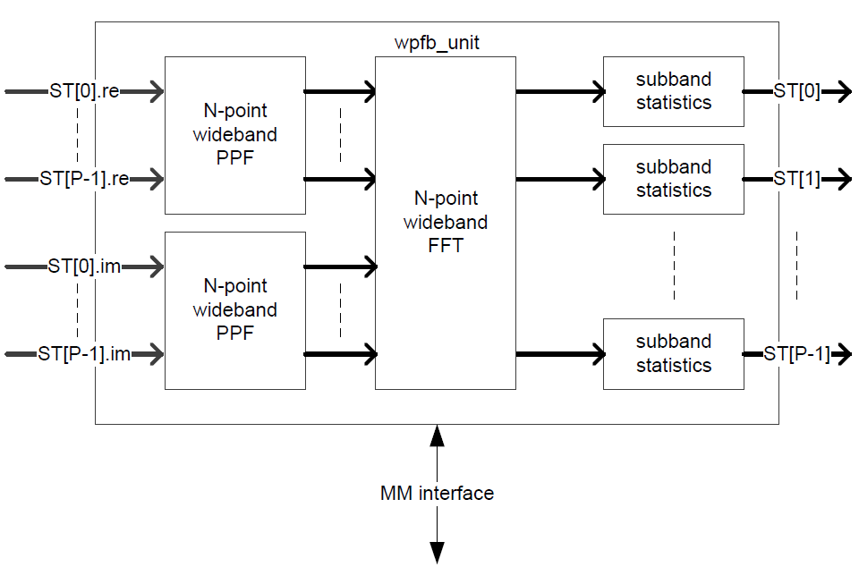
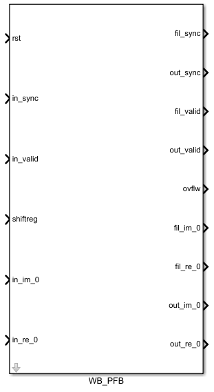
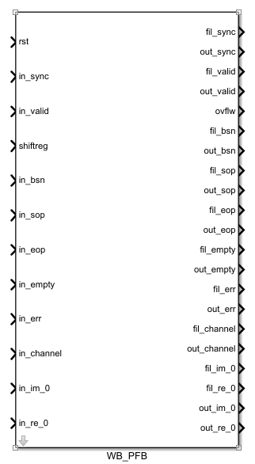

############
Wideband PFB
############
.. _wb_pfb:

*******
Purpose
*******
.. _wb_pfb_purpose:

The wpfb unit is a Wideband Poly Phase FilterBank which can process a datastream
that is partly applied in serial and partly applied in parallel. It consists of
a Poly Phase Filter (PPF) and a Fast Fourier Transform (FFT). The wpfb distinguishes
from a single FFT by the PPF that functions as a window function in order to produce
a flat response across the channel, but also provides excellent suppression of
out-of-band signals.

***************
Module Overview
***************
.. _wb_module:

An overview of the wpfb unit is shown in Figure 1. The wpfb is build out of two
N-point wideband PPFs (one for the real input and one for the imaginary input)
and a single N-point wideband FFT. All P outputs are connected to a subband
statistic unit that calculates the power in each subband. The MM interface is used
to read and write the filter coefficients and to read out the subband
statistics (still to be done).

A control unit takes care of the correct composition of the control of the 
output streams regarding sop, eop, sync, bsn, err.
The wpfb unit can handle a wideband factor :math:`>= 1` or
a narrowband factor :math:`>= 1` (:math:`2^{nof\_chan}`).

* For wideband factor = 1 the WPFB uses a pipelined FFT.
* For wideband factor > 1 the WPFB uses a wideband FFT.
* For wideband factor >= 1 the WPFB supports setting the number of channels >= 0,
  even though the concept of channels is typically not useful when wideband factor > 1.
* The WPFB does support the binary reordering of data after the FFT.
* The WPFB can perform a complex FFT or 2 Real to 2 Complex FFT.
* The WPFB does support input flow control using the extra control signals,
  with support for gaps in the time input.

=============
Clock Domains
=============

As with the :ref:`wideband_fft`, the WPFB has a mm_clk and a dp_clk
though as with the :ref:`wideband_fft`, since no memory-mapping is supported
as yet, the PFB only makes use of the dp_clk (200MHz).

=================
Interface signals
=================
Figure 2 shows the Simulink Wideband FFT block in its base configuration. In this form, it offers a minimal set of input/output ports that are comparable with
what the CASPER FFT offers. 

Figure 3 shows the Simulink Wideband FFT block in its expanded configuration which offers the bsn, sop, eop, error, empty and channel control signals. Their function is
explained by the graph below.

The full set of signals available to the Simulink block are detailed in the table below.

+----------------+-----------------+---------------------------+----------------------------------------------------------------+
| Signal         | Type            | Size                      | Description                                                    |
+================+=================+===========================+================================================================+
| Reset          | std_logic       | 1                         | Datapath reset.                                                |
+----------------+-----------------+---------------------------+----------------------------------------------------------------+
| Clock enable   | std_logic       | 1                         | Clock enable signal (used by Xilinx black box).                |
+----------------+-----------------+---------------------------+----------------------------------------------------------------+
| Clock          | std_logic       | 1                         | Datapath clock (used by Xilinx black box).                     |
+----------------+-----------------+---------------------------+----------------------------------------------------------------+
| Sync           | std_logic       | 1                         | In/out sync pulse, preceeds data by 1 clock cycle.             |
+----------------+-----------------+---------------------------+----------------------------------------------------------------+
| Valid          | std_logic       | 1                         | In/out valid data signal. Goes high with first valid data      | 
|                |                 |                           | sample.                                                        |
+----------------+-----------------+---------------------------+----------------------------------------------------------------+
| Shiftreg       | std_logic_vector| :math:`\log2(nof\_points)`| Bit vector dictating at which stages to shift in an N-point    | 
|                |                 |                           | FFT. A '1' indicates a shift while a '0' indicates no shift at |
|                |                 |                           | that stage.                                                    |
+----------------+-----------------+---------------------------+----------------------------------------------------------------+
| Ovflw          | std_logic_vector| :math:`\log2(nof\_points)`| Bit vector dictating at which stages overflow occured in an    | 
|                |                 |                           | N-point FFT. A '1' indicates an overflow while a '0' indicates |
|                |                 |                           | no overflow at that stage.                                     |
+----------------+-----------------+---------------------------+----------------------------------------------------------------+
| bsn            | std_logic_vector| 64                        | A timestamp identification port for the data.                  |
+----------------+-----------------+---------------------------+----------------------------------------------------------------+
| sop            | std_logic       | 1                         | A start-of-packet indicator (see figure 4 for detail).         |
+----------------+-----------------+---------------------------+----------------------------------------------------------------+
| eop            | std_logic       | 1                         | An end-of-packet indicator (see figure 4 for detail).          |
+----------------+-----------------+---------------------------+----------------------------------------------------------------+
| Empty          | std_logic_vector| 16                        | Empty signal for the sosi data packet.                         |
+----------------+-----------------+---------------------------+----------------------------------------------------------------+
| Error          | std_logic_vector| 32                        | Error indicator giving 32 different one-hot encoded errors.    |
+----------------+-----------------+---------------------------+----------------------------------------------------------------+
| Channels       | std_logic_vector| 32                        | An indicator for mapping of channels to streams.               |
+----------------+-----------------+---------------------------+----------------------------------------------------------------+
| Im             | std_logic_vector| in_dat_w or out_dat_w     | Data port for either one polarisation (when doing a dual pol   |  
|                |                 |                           | FFT), or the imaginary part (when doing a complex FFT).        |
+----------------+-----------------+---------------------------+----------------------------------------------------------------+
| Re             | std_logic_vector| in_dat_w or out_dat_w     | Data port for either one polarisation (when doing a dual pol   |  
|                |                 |                           | FFT), or the real part (when doing a complex FFT).             |
+----------------+-----------------+---------------------------+----------------------------------------------------------------+

